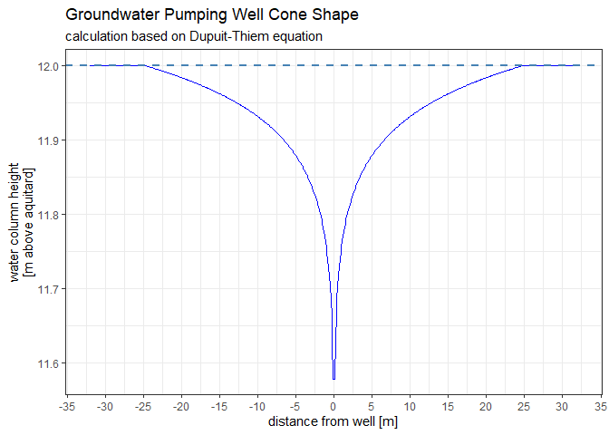

<!-- README.md is generated from README.Rmd. Please edit that file -->

# thiemwork

<!-- badges: start -->

<!-- badges: end -->

`thiemwork` provides functions and utilities to calculate the impact of
pumping wells on an aquifer, making heavy use of the
[Dupuit-Thiem](https://en.wikipedia.org/wiki/Aquifer_test#Steady-state_Thiem_solution)
equation and adjacent algorithms such as Sichardt’s equation. At this
stage of the development, only unconfined aquifers are supported
(because I happened to not care about confined ones at the time of
writing).

## Installation

`thiemwork` is not (yet) on CRAN but you can install the development
version from [GitHub](https://github.com/) with:

``` r
# install.packages("remotes")
remotes::install_github("Ignimbrit/thiemwork")
```

## Introduction

It is a common goal in engineering to manipulate the position of the
groundwater surface, e.g. by lowering it to protect a construction pit.
The most important tool for such a task is a groundwater well, which is
essentially just a huge metal straw with a filter at the end, to protect
the inlet from sand and other sediments, from which water can be pumped
(you can also infiltrate, though).

If you pump water from a well, the drawdown will form a more ore less
concentric cone shape. How the depth of this cone, its range and overall
shape relate to the well’s pumping rate and the aquifer material is
obviously very interesting to everyone who wishes to modify the local
groundwater situation.

There are several ways to tackle such problems mathematically and they
vary wildly in their complexity. The best results are usually achieved
with groundwater flow models that use finite elements or finite
differences iterative solvers of [Darcy’s
Law](https://en.wikipedia.org/wiki/Darcy%27s_law). A powerful and free
tool to do this is the USGS’s
[Modflow](https://en.wikipedia.org/wiki/Darcy%27s_law). However,
groundwater flow models are input data intensive, can be somewhat
fragile and are infamously tedious to set up.

A much simpler and often “fair enough” approach (if you generously
account for uncertainty) is the use of empirical algorithms. Here you
provide a rather limited number of easily obtained or guessed parameters
to describe an idealized model system and get an immediate return value.
This makes empirical groundwater calculations ideal for rapid
prototyping, e.g. saving much time later when setting up the geometries
for a full-fledged flow model. The `thiemwork` package aims to implement
groundwater flow equations related to pumping wells that I found most
useful.

## Example

### Calculating well range

Suppose you have a well tapped into an unconfined porous aquifer with
hydraulic conductivity `3*10E-4` m/s and want to pump some water. You
are, however, concerned that the ensuing groundwater drawdown will
affect nearby structures. You look around and conclude that the effects
of the pumping must remain limited to an area within 30 m radius to your
well. This is what Sichardt’s equation is for.

``` r
library(thiemwork)

well_drawdown <- 1 # m
hydraulic_conductivity <- 3*10^-4 # m/s
sichardt(dh = well_drawdown, kf = hydraulic_conductivity)
#> [1] 51.96152
```

Well, that was to much. Let’s iterate a bit around and see if we can
find an ideal solution

``` r

well_drawdown_sequence <- seq(0.1, 1, 0.1) # m

well_range_sequence <- sapply(
  well_drawdown_sequence, 
  sichardt, 
  kf = hydraulic_conductivity
  )

max(well_drawdown_sequence[well_range_sequence < 30])
#> [1] 0.5
```

Alas, we must not pump at a rate that does lower the hydraulic potential
within the well for more than 0.5 m.

### Calculating well pumping rates

But how much water can we actually draw from the well, before its water
table drops for more than 0.5 m? Here we can use the Dupuit-Thiem
equation. To do so we need to know some more parameters, however. We
need to know the radius of our well tube and the height of the aquifers
water column above the aquitard `h`.

``` r

undisturbed_h <- 12 # m above aquitard
well_radius <- 0.05 # m

thiem_Q( # this function returns the pumping rate Q in m³/s
  h1 = undisturbed_h - 0.5, # water column in our well if we create .5 m drawdown
  h2 = undisturbed_h,
  r1 = well_radius,
  r2 = 30, # m; distance at which no more drawdown is observed,
  kf = hydraulic_conductivity
)
#> [1] 0.001731161
```

So we can safely pump about 1.7 l/s without demolishing the
surroundings, which isn’t too bad.

### Calculating well drawdown cone shapes

But is the drawdown we can create as calculated above enough to do some
light earthwork? At this point the example gets a bit fantasy-ish as 0.5
m drawdown will in very few situations be enough to protect anything in
the formerly saturated zone. But let’s play along. How does the cone
shape look like in 1, 5, 10 m distance from the well?

``` r
library(ggplot2)
#> Warning: package 'ggplot2' was built under R version 4.0.3

distance_from_well <- seq(0.1, 32, 0.1)

h_at_x <- sapply(
  distance_from_well,
  thiem_coneshape,
  Q = 0.0017, 
  h0 = undisturbed_h, 
  r_well = well_radius, 
  kf = hydraulic_conductivity
)

plotdf <- data.frame(
  distance_from_well = c(distance_from_well, -distance_from_well),
  water_coloumn_height = c(h_at_x, h_at_x)
)

ggplot(
  data = plotdf, 
  mapping = aes(x = distance_from_well, y = water_coloumn_height)
) +
  geom_line(size = 0.65, color = "blue") +
  geom_hline(yintercept = 12, color = "steelblue", linetype = 2, size = 1) +
  scale_x_continuous(breaks = seq(-35, 35, 5)) +
  labs(
    x = "distance from well [m]",
    y = "water column height\n[m above aquitard]",
    title = "Groundwater Pumping Well Cone Shape",
    subtitle = "calculation based on Dupuit-Thiem equation"
    ) +
  theme_bw()
```



## Disclaimer

`thiemwork` is a prove of concept package used for testing and
plausibility checks and, as you can see from the license, comes with no
warranty whatsoever. It should definitely never at all be used in a
production environment. There is plenty of professional software
available for that.
